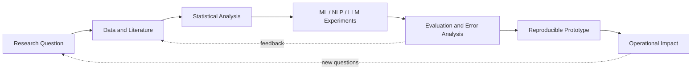

<p align="center">

</p> <h1 align="center">Osama Gharib Al-Waly</h1> <p align="center">
  <strong>AI Engineer & Data Scientist · Research, R&D, and Applied Artificial Intelligence</strong>
</p> <p align="center">
  <a href="https://github.com/OsamaGharibElwaly"></a>
  <a href="https://osama-gharib-elwaly.vercel.app/"></a>
  <a href="https://linkedin.com/in/osama-alwaly/"></a>
  <a href="mailto:osamagharib04@gmail.com"></a>
</p> <p align="center">
  <a href="#about-me">About Me</a> ·
  <a href="#research-and-rd">Research & R&D</a> ·
  <a href="#academic-projects">Projects</a> ·
  <a href="#skills">Skills</a> ·
  <a href="#opportunities-and-collaboration">Opportunities</a> ·
  <a href="#contact">Contact</a>
</p>

---

<a id="about-me"></a>

<details open>
<summary><strong>About Me</strong></summary>

I am a **Computer Engineering graduate** building my career at the intersection of **Data Science, Artificial Intelligence, Statistics, and software engineering**. My strongest motivation is to work on problems where careful research, rigorous experimentation, and practical engineering can produce solutions that are measurable and useful in real environments.

I am pursuing a long-term path in **Research and Development**, while remaining open to opportunities in the wider job market, including **AI Engineer, Data Scientist, Machine Learning Engineer, Research Engineer, and applied R&D roles**. I am also preparing for future Master's and PhD study by strengthening my foundations in statistics, machine learning, scientific computing, and research communication.

My approach follows the full **research-to-impact cycle**: define a meaningful problem, study existing approaches, prepare and understand the data, design reproducible experiments, evaluate results honestly, analyze failure cases, and turn findings into a reliable prototype or decision-support system.

My current direction combines **NLP, LLMs, information retrieval, RAG, AI-system evaluation, predictive analytics, optimization, and operational data science**. I am especially interested in applications across **manufacturing, transportation, logistics, and supply-chain systems**, where AI can support forecasting, predictive maintenance, process optimization, and intelligent decision-making.

> **My goal:** grow into an AI Engineer and Data Scientist who can move confidently between academic research, R&D experimentation, and production-oriented intelligent systems.

<details>
<summary><strong>Explore my research mindset</strong></summary>

- **Reproducibility:** Clear experiments, documented assumptions, versioned code, and repeatable workflows.

- **Reliability:** Explicit evaluation criteria, error analysis, validation, and careful separation of deterministic and probabilistic components.

- **Practical impact:** Research questions connected to operational efficiency, process improvement, forecasting, and decision support.

- **Continuous learning:** Reading research, building experiments, comparing methods, and translating lessons into better systems.

</details> </details>

<a id="research-and-rd"></a>

<details>
<summary><strong>Research and R&D Direction</strong></summary>

<strong>Core Academic Fields</strong>

- Data science and statistical analysis

- Artificial intelligence and machine learning

- Natural language processing and language models

- Information retrieval and retrieval-augmented generation

- Experimental design and reproducible research

- AI and LLM evaluation, validation, and reliability

<strong>Application Areas</strong>

I am especially interested in applying data-driven and AI methods to **manufacturing, transportation, logistics, supply-chain systems, predictive maintenance, forecasting, process optimization, and intelligent decision-making**.

These application areas connect technical research with operational challenges where better data analysis, prediction, and decision support can produce measurable improvements.

<strong>Interactive Research-to-Impact Map</strong>



<details>
<summary><strong>Explore possible R&D themes</strong></summary>

- Predictive maintenance and anomaly detection

- Forecasting for transportation, logistics, and inventory systems

- Process optimization and intelligent decision support

- NLP and LLM tools for technical or operational documents

- Retrieval quality, grounded generation, and trustworthy AI

- Data-centric experimentation and model-performance analysis

</details> </details>

<a id="academic-projects"></a>

<details>
<summary><strong>Academic Projects</strong></summary> <details>
<summary><strong>Research Data Science Lab</strong></summary>

**Independent Research Project · Python · R · Statistics · Machine Learning**

A research-oriented learning and experimentation environment focused on applying statistical and data-science methods to practical problems.

- Covers statistical inference, hypothesis testing, ANOVA, regression, predictive modeling, and experimental analysis.

- Uses Python and R to implement reproducible statistical experiments and practical exercises.

- Focuses on model evaluation, statistical reasoning, data interpretation, and connecting analytical methods to real-world decisions.

- Serves as a foundation for future research in predictive analytics, operational efficiency, and process optimization.

</details> <details>
<summary><strong>Supply Chain Lab</strong></summary>

**Independent Learning and Professional Development · ASCM CLTD · Logistics · Transportation · Supply Chain**

A structured knowledge base connecting supply-chain concepts with future applications of data science and artificial intelligence.

- Covers the nine modules of the ASCM CLTD curriculum, including logistics, transportation, warehousing, inventory, and distribution.

- Develops domain knowledge for future work on supply-chain optimization, transportation systems, forecasting, and data-driven decision-making.

- Establishes a foundation for continued professional development in supply-chain management and related certifications.

</details> <details>
<summary><strong>DistilBERT Fine-Tuning — Sentiment-Analysis Pipeline</strong></summary>

**Python · PyTorch · Hugging Face Transformers · Google Colab**

An end-to-end NLP experiment for studying transformer-based text classification.

- Implemented dataset preparation, tokenization, fine-tuning, evaluation, and model inference.

- Separated training, evaluation, and inference stages to support reliable and reproducible experimentation.

- Strengthened practical understanding of transformer models, NLP workflows, and model-performance analysis.

</details> <details>
<summary><strong>Additional AI Engineering Projects</strong></summary>

- [Intelligent NLP-Powered Document Management System](https://github.com/OsamaGharibElwaly/intelligent-nlp-powered-document-management-system) — RAG, document intelligence, semantic retrieval, citations, and grounded answers.

- [Resume Job Parser](https://github.com/OsamaGharibElwaly/resume_job_parser) — deterministic and semantic resume-to-job matching with structured LLM extraction.

- [AI-First CRM HCP Module](https://github.com/OsamaGharibElwaly/ai-first-crm-hcp-module) — tool-first AI-agent workflows using LangGraph, FastAPI, and PostgreSQL.

- [User and Order API QA Automation](https://github.com/OsamaGharibElwaly/user-order-api-qa-automation) — API validation, automated testing, Docker, and CI/CD.

</details> </details>

<a id="skills"></a>

<details>
<summary><strong>Skills and Technical Stack</strong></summary>

<strong>Research and Scientific Computing</strong>

Literature review, research-paper analysis, statistical reasoning, experimental design, hypothesis testing, model evaluation, technical writing, LaTeX, experimental documentation, and reproducible research.

<strong>Data Science and Statistics</strong>

Probability and statistics, statistical modeling fundamentals, regression, ANOVA, predictive modeling, feature engineering, data analysis, model comparison, and experimental analysis.

<strong>Machine Learning and AI</strong>

Scikit-learn, PyTorch, Hugging Face Transformers, machine-learning algorithms, NLP, LLMs, generative AI, embeddings, and model validation.

<strong>LLM and Retrieval Engineering</strong>

LangChain, LangGraph, OpenAI API, retrieval-augmented generation, prompt engineering, AI agents, vector search, retrieval systems, and LLM evaluation.

<strong>Programming and Systems</strong>

Python, R, JavaScript, TypeScript, SQL, FastAPI, REST APIs, asynchronous Python, PostgreSQL, MongoDB, FAISS, Pinecone, and data pipelines.

<strong>Engineering, Testing, and Deployment</strong>

Docker, Docker Compose, AWS ECR/EC2/S3/Lambda, Git, GitHub Actions, CI/CD, pytest, Postman, ISTQB principles, API validation, and software quality assurance.

</details>

<a id="academic-background"></a>

<details>
<summary><strong>Academic Background</strong></summary>

**Bachelor of Science in Computer Engineering**Port Said University, Egypt · October 2020 – July 2025GPA: **2.97 / 4.00** — Good

</details>

<a id="certifications"></a>

<details>
<summary><strong>Certifications and Training</strong></summary>

- **One Million Prompters Certificate** — Dubai Future Foundation. Prompt engineering for AI systems and LLM optimization.

- **Effective Communication Skills Program** — Arab Academy for Science, Technology & Maritime Transport. Communication and cross-functional collaboration.

</details>

<a id="experience"></a>

<details>
<summary><strong>Experience</strong></summary>

<strong>Volunteer Speaker — Pioneer of Success Initiative, Egyptian Ministry of Youth & Sports</strong>

**August 2025 – Present**Deliver online training on LinkedIn usage, AI-assisted job-search tools, and CV optimization.

<strong>Trainee — Suez Canal Authority</strong>

**June 2023 – September 2023**Worked with network systems and explored performance optimization using Cisco Packet Tracer.

<strong>Trainee — Port Said University</strong>

**June 2022 – September 2022**Applied engineering concepts in electronics laboratories using MATLAB.

</details>

<a id="current-focus"></a>

<details>
<summary><strong>Current Research and R&D Focus</strong></summary>

```python
current_focus = {
    "researching": [
        "Statistical inference, experimental design, and model evaluation",
        "NLP and transformer-based machine learning",
        "LLM reliability, retrieval quality, and grounded generation",
        "Predictive analytics for operational and supply-chain problems",
    ],
    "building": [
        "Reproducible research notebooks and data-science experiments",
        "AI prototypes with Python, FastAPI, and modern ML frameworks",
        "Evaluation and validation workflows for intelligent systems",
    ],
    "developing": [
        "R and Python for applied statistics and data science",
        "Domain knowledge in logistics, transportation, and supply chains",
        "Research writing, technical documentation, and literature review",
    ],
    "long_term_goal": (
        "Build a research and R&D career developing reliable AI and data-driven "
        "solutions for real-world operational challenges."
    ),
}
```

</details>

<a id="opportunities-and-collaboration"></a>

<details open>
<summary><strong>Opportunities and Collaboration</strong></summary>

I am open to opportunities that connect **research, R&D, data science, and AI engineering**, including:

- Research internships, research assistantships, and graduate-research opportunities.

- Junior AI Engineer, Machine Learning Engineer, Data Scientist, Research Engineer, and applied R&D roles.

- Projects involving predictive analytics, NLP, LLM applications, model evaluation, process optimization, forecasting, and intelligent decision-support systems.

- Applied AI work in manufacturing, transportation, logistics, supply chains, and other data-rich operational environments.

- Collaborations involving reproducible experiments, technical research, data analysis, or AI-system prototyping.

I am particularly interested in environments where I can **learn from experienced researchers and engineers, contribute to meaningful projects, and grow toward a long-term research and development career**.

<details>
<summary><strong>What I can contribute</strong></summary>

- Research-oriented Python and data-science experimentation.

- Statistical analysis, model evaluation, and error analysis.

- NLP, LLM, RAG, and information-retrieval prototypes.

- FastAPI backends and Dockerized AI services.

- Technical documentation, reproducibility, and quality assurance.

</details> </details>

<a id="contact"></a>

<details open>
<summary><strong>Contact</strong></summary>

- **Email:** [osamagharib04@gmail.com](mailto:osamagharib04@gmail.com)

- **Portfolio:** [osama-gharib-elwaly.vercel.app](https://osama-gharib-elwaly.vercel.app/)

- **LinkedIn:** [linkedin.com/in/osama-alwaly](https://linkedin.com/in/osama-alwaly/)

- **GitHub:** [github.com/OsamaGharibElwaly](https://github.com/OsamaGharibElwaly)

</details>

<a id="languages"></a>

<details>
<summary><strong>Languages</strong></summary>

- **Arabic:** Native

- **English:** Professional working proficiency

- **Turkish:** Beginner — A1

</details>

<a id="github-dashboard"></a>

<details>
<summary><strong>Interactive GitHub Dashboard</strong></summary> <p align="center">
  <a href="https://github.com/OsamaGharibElwaly?tab=repositories">
    
  </a>
  <a href="https://github.com/OsamaGharibElwaly?tab=stars">
    
  </a>
</p> <p align="center">
  <a href="https://github.com/OsamaGharibElwaly?tab=activity">
    
  </a>
</p> <p align="center">
  <a href="https://github.com/OsamaGharibElwaly?tab=repositories">Browse repositories</a> ·
  <a href="https://github.com/OsamaGharibElwaly?tab=stars">View starred projects</a> ·
  <a href="https://github.com/OsamaGharibElwaly?tab=activity">View activity</a>
</p> </details>
